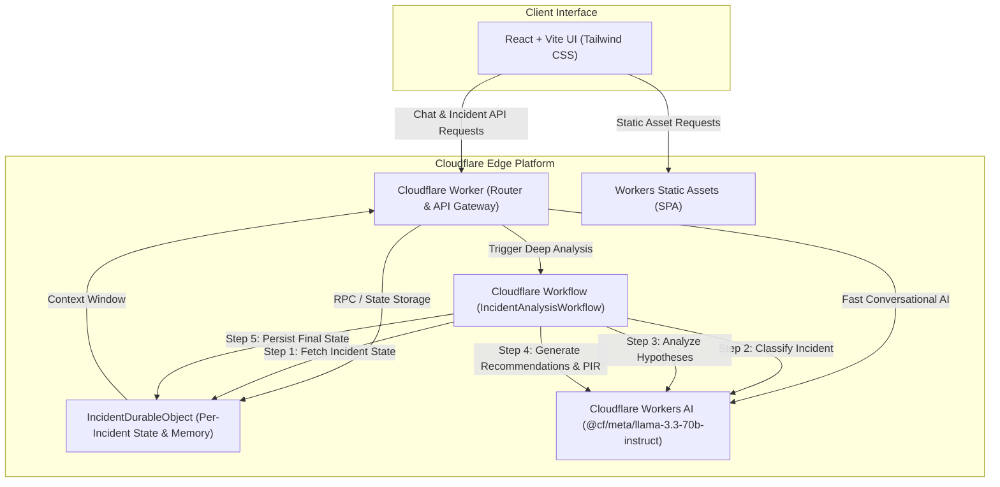

# AI Incident Assistant

Production-grade, edge-native AI incident response platform built on Cloudflare's serverless infrastructure. It equips on-call site reliability engineers and developers with real-time interactive triage, memory-backed session context, heuristic severity classification, and durable multi-step workflow orchestration for Post-Incident Reviews (PIR).

---

## Overview

During a production incident, cognitive overload and fragmented communication elevate Mean Time to Resolution (MTTR). The **AI Incident Assistant** provides an interactive incident command room that:
- Captures real-time incident symptoms and log transcripts.
- Acts as a **Senior Production & SRE Engineer** applying distributed systems reasoning (detecting database pool starvation, retry storms, cascading timeouts, deployment regressions).
- Preserves conversation history and incident hypotheses using **Cloudflare Durable Objects**.
- Coordinates multi-step, durable post-incident triage and reporting via **Cloudflare Workflows**.
- Runs high-throughput LLM inference at the edge using **Cloudflare Workers AI** powered by **Llama 3.3** (`@cf/meta/llama-3.3-70b-instruct`).

---

## Features

- **Interactive Incident Command Room**: Real-time chat with distinct user, senior SRE, and workflow system status messages.
- **Evidence-Grounded AI Reasoning**: Strict system prompts prevent hallucinations, distinguish observed facts from hypotheses, and propose non-destructive diagnostics and safe rollbacks.
- **Live Observability & Structured Analysis**: Continuous extraction of severity (`CRITICAL`, `HIGH`, `MEDIUM`, `LOW`), verified symptoms, ranked root-cause hypotheses, investigation steps, and follow-up questions.
- **Durable Per-Incident Memory**: Isolated Durable Object storage per incident prevents cross-session leaks and eliminates race conditions.
- **Smart Context Window Management**: Preserves original incident declaration while sliding a bounded context window to respect token budgets.
- **5-Step Durable Workflow**: Asynchronous pipeline for deep triage, classification, recommendation synthesis, report generation, and persistence.
- **Automated Post-Incident Review (PIR)**: Formatted executive summary, timeline, 5-Whys root-cause analysis, and prioritized preventative action items (`[P0]`, `[P1]`, `[P2]`) with one-click Markdown export.

---

## Architecture



---

## Tech Stack

| Layer | Technology | Purpose |
|---|---|---|
| **Edge Compute** | Cloudflare Workers | Serverless edge API gateway, CORS handling, routing |
| **State & Memory** | Cloudflare Durable Objects | Strongly consistent transactional storage per incident |
| **Orchestration** | Cloudflare Workflows | Stateful, retryable 5-step incident analysis pipeline |
| **LLM Inference** | Cloudflare Workers AI | Meta Llama 3.3 (`@cf/meta/llama-3.3-70b-instruct`) |
| **Frontend UI** | React 18, TypeScript, Vite | Dark-mode developer console, Lucide icons, Tailwind CSS |
| **Static Hosting** | Cloudflare Workers Static Assets | Direct edge SPA distribution |
| **Test Suite** | Vitest | Automated tests for API contracts, memory, and AI parsing |

---

## Cloudflare Services

- **Cloudflare Workers**: Serves as the application gateway (`src/index.ts`). Routes REST API requests (`/api/incidents/*`) and delegates frontend requests to Static Assets.
- **Cloudflare Durable Objects**: Provides transactional per-incident memory (`src/durable-object/IncidentDurableObject.ts`). Stores chronological messages, structured analysis, metadata, and handles bounded context windowing. A singleton DO instance manages the global incident registry.
- **Cloudflare Workflows**: Coordinates the 5-step deep incident triage pipeline (`src/workflows/IncidentAnalysisWorkflow.ts`). Decouples heavy multi-prompt analysis from synchronous HTTP timeouts.
- **Cloudflare Workers AI**: Runs inference on `@cf/meta/llama-3.3-70b-instruct` for real-time conversational chat, structured JSON telemetry extraction, and Post-Incident Reviews. Includes automatic fallback to `@cf/meta/llama-3.1-70b-instruct`.
- **Workers Static Assets**: Distributes the compiled Vite single-page application directly from `./frontend/dist`.

---

## How It Works

1. **Incident Declaration**: The user starts a new incident session in the UI. The Worker initializes an `IncidentDurableObject` instance with a unique UUID.
2. **Interactive Triage**: The user posts observed symptoms (e.g. *"Payment API returning 500s after deployment"*). The Worker retrieves the bounded context window from the Durable Object and invokes Workers AI.
3. **Structured Telemetry Extraction**: Concurrently, the AI service extracts structured JSON assessment data (symptoms, hypotheses, severity, remediation). The resilient parser cleans and validates this data, updating the live telemetry rail.
4. **Deep Workflow Trigger**: The engineer clicks **Run Workflow** or requests a Post-Incident Review. A Cloudflare Workflow instance is dispatched to execute the 5-step pipeline:
   - `fetch incident state`: Pulls snapshot from the target Durable Object.
   - `classify incident`: Assesses severity and blast radius.
   - `analyze incident`: Formulates ranked root-cause hypotheses.
   - `generate recommendations and report`: Generates markdown PIR.
   - `persist final result`: Commits data to the Durable Object and broadcasts a system event message into the chat.
5. **Review & Export**: The engineer inspects the generated report, toggles between formatted view and raw Markdown, and exports the document.

---

## Memory Design

Persistent conversation state and session history are backed by **Cloudflare Durable Objects**:
- **Isolation**: Each incident ID maps to an independent Durable Object instance via `idFromName(incidentId)`. Data is strictly isolated with zero cross-tenant contamination.
- **Durability**: Messages and analyses are persisted using `this.ctx.storage.put('incident_state', state)`. State survives edge worker restarts.
- **Context Window Management**: To prevent exceeding LLM token budgets while maintaining critical context, `getContextForAI()` implements a bounded sliding window:
  - Preserves **Message #0** (the root incident declaration containing initial symptoms).
  - Preserves the **last 9 messages** to maintain immediate conversational context.
  - Intermediate messages are retained in full for audit and report generation, but trimmed from conversational LLM prompts.

---

## Workflow Design

Cloudflare Workflows coordinates long-running, multi-step incident analysis:
- **Why Workflows?** Heavy multi-prompt evaluation, schema repair, and report synthesis can exceed standard synchronous worker CPU/wall-clock constraints or fail on transient network hiccups. Workflows provides guaranteed completion, automatic step retries, and state persistence.
- **When is it used?** Workflows is intentionally **not** forced on every simple chat interaction. Chat runs with low-latency edge Workers, while deep post-incident analysis and report synthesis use the Workflow.

---

## AI Design & Prompts

The system prompt configures Workers AI as a **Senior Site Reliability Engineer**:
- **Evidence-First**: Never assumes access to internal VPCs, logs, or metrics not provided in the transcript.
- **Facts vs. Hypotheses**: Separates verified symptoms from unverified theories.
- **Safe Remediation First**: Prioritizes service stabilization (traffic shedding, rollbacks) over deep debugging during an outage.
- **Resilient JSON Parser**: Extracts JSON from Markdown code blocks (````json ... ````), normalizes severity aliases (`P0`, `SEV-1`, `500 errors`), and applies fallback heuristics if the LLM output is malformed.

---

## Local Development

### Prerequisites
- Node.js 20+ (tested on Node v24)
- npm 10+
- Cloudflare Wrangler v4+

### Installation
```bash
# 1. Clone repository
git clone https://github.com/dkdhineshkumar2904-alt/ai-incident-assistant.git
cd ai-incident-assistant

# 2. Install backend dependencies
npm install

# 3. Install frontend dependencies
npm --prefix frontend install
```

### Running Locally
```bash
# Terminal 1: Start frontend development server (Vite with API proxy)
npm run dev:frontend
# Frontend runs at http://localhost:5173

# Terminal 2: Start Cloudflare Worker dev server
npm run dev
# Worker runs at http://127.0.0.1:8787
```

---

## Environment Variables

Configured in `wrangler.jsonc`:

| Variable | Type | Default | Description |
|---|---|---|---|
| `ENVIRONMENT` | Var | `"production"` | Environment tag |
| `AI_MODEL` | Var | `"@cf/meta/llama-3.3-70b-instruct"` | Primary Workers AI model |
| `AI` | Binding | Workers AI | Cloudflare Workers AI binding |
| `INCIDENT_DO` | Binding | Durable Object | Durable Object namespace |
| `INCIDENT_WORKFLOW` | Binding | Workflow | Cloudflare Workflows binding |
| `ASSETS` | Binding | Static Assets | Static asset serving directory (`./frontend/dist`) |

*Note: No secret API keys are required because Cloudflare Workers AI, Durable Objects, and Workflows communicate via native Cloudflare edge bindings.*

---

## Cloudflare Setup & Deployment

### Step 1: Authenticate with Cloudflare
```bash
npx wrangler login
```

### Step 2: Build & Validate
```bash
# Build frontend static assets
npm run build:frontend

# Validate Cloudflare Worker bindings (dry-run)
npx wrangler deploy --dry-run
```

### Step 3: Deploy to Cloudflare
```bash
npm run deploy
```

Wrangler will provision:
1. The Cloudflare Worker.
2. The `IncidentDurableObject` binding and SQLite migration.
3. The `IncidentAnalysisWorkflow` definition.
4. The Workers AI binding.
5. Upload the frontend assets to Workers Static Assets.

---

## Testing

The project includes an automated test suite verifying critical paths:
```bash
# Run Vitest test suite
npm test

# Run TypeScript type check across Worker and Frontend
npm run typecheck
```

### Test Coverage Breakdown
- `tests/ai-parser.test.ts`: Severity normalization, Markdown fence stripping, schema validation, malformed output heuristic repair.
- `tests/memory.test.ts`: Durable Object initialization, atomic message appending, bounded context window (preserving root message), report persistence.
- `tests/api.test.ts`: CORS headers, incident creation, message input validation (HTTP 400), conversational reply generation, analysis trigger, PIR generation, 404 handlers.
- `tests/workflow.test.ts`: 5-step pipeline execution, step sequencing, and Durable Object state persistence.

---

## Project Structure

```text
ai-incident-assistant/
├── src/
│   ├── index.ts                         # Cloudflare Worker API router & static asset gateway
│   ├── types/
│   │   └── index.ts                     # Domain models, API contracts, Cloudflare Env
│   ├── ai/
│   │   ├── ai-service.ts                # IAIService abstraction (Workers AI & Mock engines)
│   │   ├── prompts.ts                   # Senior SRE system prompts & context formatters
│   │   └── parser.ts                    # Resilient JSON extraction and schema repair
│   ├── durable-object/
│   │   └── IncidentDurableObject.ts     # Per-incident persistent state & memory store
│   └── workflows/
│       └── IncidentAnalysisWorkflow.ts  # Cloudflare Workflows 5-step pipeline
├── frontend/
│   ├── src/
│   │   ├── App.tsx                      # Main application layout
│   │   ├── main.tsx                     # React root mount
│   │   ├── types.ts                     # Frontend domain types
│   │   ├── services/
│   │   │   └── api.ts                   # Type-safe API client
│   │   └── components/
│   │       ├── Header.tsx               # Status bar & action triggers
│   │       ├── Sidebar.tsx              # Incident session switcher & search
│   │       ├── ChatView.tsx             # Interactive chat stream & quick prompts
│   │       ├── IncidentAnalysisPanel.tsx# Live telemetry & structured SRE card
│   │       ├── ReportModal.tsx          # Post-Incident Review modal & exporter
│   │       └── NewIncidentModal.tsx     # Incident declaration with demo scenarios
│   ├── package.json
│   ├── vite.config.ts
│   └── tailwind.config.js
├── tests/
│   ├── ai-parser.test.ts                # Parser resilience & schema tests
│   ├── memory.test.ts                   # Durable Object memory tests
│   ├── api.test.ts                      # REST API endpoint tests
│   ├── workflow.test.ts                 # 5-step workflow pipeline tests
│   └── mocks/
│       └── cloudflare-workers.ts        # Vitest mock runtime shims
├── docs/
│   ├── AI-ASSISTANCE.md                 # AI methodology and governance documentation
│   └── prompt-history/                  # Chronological prompt logs (01 to 09)
├── wrangler.jsonc                       # Cloudflare configuration & service bindings
├── package.json                         # Root project scripts and dependencies
└── README.md
```

---

## AI-Assisted Development

This application was developed using AI-assisted coding in accordance with the assignment instructions. A complete, authentic log of prompts, technical reasoning, and engineering decisions is preserved in:
- [`/docs/AI-ASSISTANCE.md`](./docs/AI-ASSISTANCE.md)
- [`/docs/prompt-history/`](./docs/prompt-history/)
  - `01-project-architecture.md`
  - `02-backend.md`
  - `03-ai-integration.md`
  - `04-memory.md`
  - `05-workflow.md`
  - `06-frontend.md`
  - `07-testing.md`
  - `08-debugging.md`
  - `09-final-review.md`

---

## Limitations / Future Improvements

- **Authentication & RBAC**: The current version does not enforce SSO/OAuth, allowing frictionless evaluation during technical review. Production deployments should integrate Cloudflare Access or OAuth 2.0.
- **Third-Party Telemetry Connectors**: Currently, telemetry is ingested through user transcripts and error snippets. Direct webhook integration with Datadog, Grafana, and PagerDuty would streamline initial triage.
- **Streaming Responses**: Conversational responses currently return upon full generation. Implementing Server-Sent Events (SSE) via Cloudflare Workers streaming would provide word-by-word streaming in the chat UI.
- **D1 Analytics Archival**: Resolved incident reports could be indexed in Cloudflare D1 for cross-incident semantic search.

---

## License
MIT License. Authored by Dhineshkumar Selladurai.
